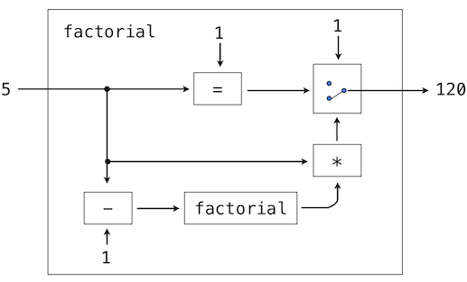

# 3.5 抽象语言的解释器

:::details INFO
译者：[silver](https://github.com/silver-ymz)

来源：[3.5 Interpreters for Languages with Abstraction](http://www.composingprograms.com/pages/35-interpreters-for-languages-with-abstraction.html)

对应：Disc 11、Disc 12、Disc 13、Disc 14、HW 07、HW 08、HW 09、Lab 11、Lab 12、Lab 13、Lab 14、Scheme、Scheme Challenge、Scheme Contest
:::

计算器语言提供了一种方法，来组合嵌套的调用表达式。但是，它无法定义新的运算符、为值命名或表达通用的计算方法。计算器语言不支持任何方式的抽象。因此，它不是一种特别强大或通用的编程语言。现在，我们的任务是定义一种通用编程语言，通过将名称绑定到数值和定义新操作来支持抽象。

上一章以 Python 源代码的形式提供了一个完整的解释器。与此不同，本章将采用描述性的方法。配套项目要求你构建一个功能齐全的 Scheme 解释器来实现这里提出的想法。

## 3.5.1 结构

本节介绍 Scheme 解释器的一般结构。完成该项目即可产生本文所述解释器的可用实现。

Scheme 解释器与计算器语言解释器的结构基本相同。解析器生成表达式，表达式由求值函数解释。求值函数检查表达式的形式，对于调用表达式，它调用一个函数对某些参数进行应用。求值器的大部分差异都与特殊形式、用户自定义函数和计算环境模型的实现相关。

**解析**：计算器语言解释器中的 [scheme_reader](https://www.composingprograms.com/examples/scalc/scheme_reader.py.html) 和 [scheme_tokens](https://www.composingprograms.com/examples/scalc/scheme_tokens.py.html) 模块几乎足以解析任何有效的 Scheme 表达式。不过，它还不支持引号或点列表。完整的 Scheme 解释器应该能够解析以下输入表达式。

```py
>>> read_line("(car '(1 . 2))")
Pair('car', Pair(Pair('quote', Pair(Pair(1, 2), nil)), nil))
```

实现 Scheme 解释器的第一个任务是扩展 [scheme_reader](https://www.composingprograms.com/examples/scalc/scheme_reader.py.html) 以正确解析点列表和引号。

**求值**（Evaluation）。 Scheme 一次计算一个表达式。求值器的框架实现在配套项目的 `scheme.py` 中定义。`scheme_read` 返回的每个表达式都传递给 `scheme_eval` 函数，该函数计算当前环境 `env` 中的表达式 `expr`。

`scheme_eval` 函数用于对 Scheme 中不同形式的表达式进行求值，包括基元、特殊形式和调用表达式。在 Scheme 中，组合形式可以通过检查其第一个元素来确定。每种特殊形式都有自己的求值规则。下面是 `scheme_eval` 的简化实现。为了便于讨论，我们删除了一些错误检查和特殊形式处理。完整的实现见配套项目。

```py
>>> def scheme_eval(expr, env):
        """Evaluate Scheme expression expr in environment env."""
        if scheme_symbolp(expr):
            return env[expr]
        elif scheme_atomp(expr):
            return expr
        first, rest = expr.first, expr.second
        if first == "lambda":
            return do_lambda_form(rest, env)
        elif first == "define":
            do_define_form(rest, env)
            return None
        else:
            procedure = scheme_eval(first, env)
            args = rest.map(lambda operand: scheme_eval(operand, env))
            return scheme_apply(procedure, args, env)
```

**函数应用**（Procedure application）。上面的最后一种情况调用了第二个函数，即由函数 `scheme_apply` 实现的函数应用。与计算器语言中的 `calc_apply` 函数相比，Scheme 中的函数应用流程要通用得多。它作用于两种参数：`PrimitiveProcedure` 或 `LambdaProcedure`。`PrimitiveProcedure` 是由 Python 实现的；它包含一个绑定到 Python 函数的实例属性 `fn`。此外，它可能需要也可能不需要访问当前环境。每当应用该函数时，都会调用该 Python 函数。

`LambdaProcedure` 是用 Scheme 实现的。它有一个 `body` 属性，该属性是一个 Scheme 表达式，每当该函数被应用时都会对其进行求值。要将函数应用于参数列表，需要在一个新环境中对主体表达式进行求值。为了构建这个环境，需要在环境中添加一个新的帧。在这帧中，该函数的形式参数将与实际参数相绑定。然后，主体表达式将使用 `scheme_eval` 进行求值。

**求值/应用递归**。实现求值整个流程的函数 `scheme_eval` 和 `scheme_apply` 是相互递归的。每当遇到调用表达式时，求值函数都将调用应用函数。而应用函数使用求值函数，将操作数表达式求值为参数，或者对用户定义的函数进行求值。这种相互递归的结构在解释器中非常普遍：求值通过应用来定义，应用又通过求值来定义。

这种递归循环以语言基元结束。求值函数有一个基本情况，即对一个基元表达式求值。一些特殊形式也构成了没有递归调用的基本情况。同样地，应用函数也有一个基本情况，即应用于一个基元函数。处理表达式的求值函数与处理函数及其参数的应用函数相互调用，这种相互递归的结构，构成了求值流程的本质。

## 3.5.2 环境

现在我们已经描述了 Scheme 解释器的结构，接下来我们来实现构成环境的 `Frame` 类。每个 `Frame` 实例代表一个环境，在这个环境中，符号与值绑定。一个帧有一个保存绑定（`bindings`）的字典，以及一个父（`parent`）帧。对于全局帧而言，父帧为 `None`。

绑定不能直接访问，而是通过两种 `Frame` 方法：`lookup` 和 `define`。第一个方法实现了第一章中描述的计算环境模型的查找流程。符号与当前帧的绑定相匹配。如果找到它，则返回它绑定到的值。如果没有找到，则继续在父帧中查找。另一方面，`define` 方法用来将符号绑定到当前帧中的值。

`lookup` 的实现和 `define` 的使用留作练习。为了说明它们的用途，请看以下 Scheme 程序示例：

```scheme
(define (factorial n)
  (if (= n 0) 1 (* n (factorial (- n 1)))))

(factorial 5)
120
```

第一个输入表达式是一个 `define` 形式，将由 Python 函数 `do_define_form` 求值。定义一个函数有如下步骤：

1. 检查表达式的格式，确保它是一个格式良好的 Scheme 列表，在关键字 `define` 后面至少有两个元素。
2. 分析第一个元素（这里是一个 `Pair`），找出函数名称 `factorial` 和形式参数表 `(n)`。
3. 使用提供的形式参数、函数主体和父环境创建 `LambdaProcedure`。
4. 在当前环境的第一帧中，将 `factorial` 符号与此函数绑定。在示例中，环境只包括全局帧。

第二个输入是调用表达式。传递给 `scheme_apply` 的 `procedure` 是刚刚创建并绑定到符号 `factorial` 的 `LambdaProcedure`。传入的 `args` 是一个单元素 Scheme 列表 `(5)`。为了应用该函数，我们将创建一个新帧来扩展全局帧（`factorial` 函数的父环境）。在这帧中，符号 `n` 被绑定为数值 5。然后，我们将在该环境中对 `factorial` 函数主体进行求值，并返回其值。

## 3.5.3 数据即程序

在思考对 Scheme 表达式进行求值的程序时，一个类比可能会有所帮助。关于程序的含义，一种操作观点认为，程序是对抽象机器的描述。例如，再看一下这个计算阶乘的程序：

```scheme
(define (factorial n)
  (if (= n 0) 1 (* n (factorial (- n 1)))))
```

我们也可以使用条件表达式在 Python 中表达一个等价的程序。

```py
>>> def factorial(n):
        return 1 if n == 1 else n * factorial(n - 1)
```

我们可以把这个程序看作是对一台机器的描述，这台机器包含减法、乘法和相等检验等部分，还有一个双位开关和另一台阶乘机。（阶乘机是无限的，因为它包含了另一个阶乘机）。下图是阶乘运算机的流程图，显示了各部分的连接方式。



类似地，我们可以把 Scheme 解释器看作是一个非常特殊的机器，它接受对机器的描述作为输入。有了这个输入，解释器就会配置自己，以模拟所描述的机器。例如，如果我们向我们的求值器输入阶乘的定义，求值器就能计算阶乘。

从这个角度看，我们的 Scheme 解释器是一种通用机器。当其他机器被描述为 Scheme 程序时，它就会模仿这些机器。它是编程语言操作的数据对象与编程语言本身之间的桥梁。想象一下，用户在我们运行的 Scheme 解释器中键入一个 Scheme 表达式。从用户的角度来看，诸如 (+ 2 2) 这样的输入表达式是编程语言中的表达式，解释器应该对其进行求值。然而，从 Scheme 解释器的角度来看，该表达式只是一个由单词组成的句子，需要根据一组定义明确的规则进行处理。

用户的程序就是解释器的数据，这不一定会引起混淆。事实上，有时忽略这种区别，让用户明确地将数据对象作为表达式来求值，也是很方便的。在 Scheme 中，每当使用 `run` 函数时，我们都会使用此功能。在 Python 中也有类似的函数：`eval` 函数可以对 Python 表达式求值，`exec` 函数将执行 Python 语句。因此，

```py
>>> eval('2+2')
4
```

和

```py
>>> 2+2
4
```

两者都返回相同的结果。在动态编程语言中，对执行过程中构建的表达式进行求值是一个常见而强大的功能。虽然很少有语言能把这种实践同 Scheme 一样普遍，但在程序执行过程中构建和求值表达式的能力对于任何程序员来说都是非常有价值的工具。
