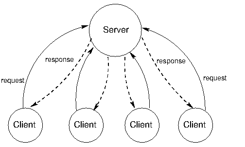

# 4.6 分布式计算

::: details INFO
译者：[Bryan Zhang](https://github.com/billycrapediem)

来源：[4.6 Distributed Computing](https://www.composingprograms.com/pages/46-distributed-computing.html)

对应：无
:::

大规模数据处理应用程序通常在多台计算机之间协调工作。分布式计算（Distributed Computeing）是指多台相互连接但独立的计算机协调合作，执行计算任务。

不同的计算机是独立的，意味着它们不直接共享内存。但是，它们通过消息（Message）进行通信，将信息通过网络从一台计算机传输到另一台计算机。

## 4.6.1 消息

在计算机之间发送的消息是字节序列（sequences of bits）。消息的目的各不相同；消息可以请求数据、发送数据，或者指示另一台计算机执行一个调用。在所有情况下，两台互相通信的计算机会使用相互绑定的编码和解码方式。为了实现这一点，计算机采用了一种消息协议，为字节序列赋予了含义。

消息协议（message protocols）是一组用于编码和解释消息的规则。发送和接收计算机都必须就消息的编码解码方式达成一致，以实现成功的通信。许多消息协议规定，消息必须符合特定的格式。比如，固定位置的某些字节（bits）指示了固定的条件。其他协议使用特定的字节或字节序列来界定消息的各个部分，就像标点符号在编程语言的语法中界定子表达式一样。

消息协议并不是特定的程序或软件库。相反，它们是一种规则，可以被各种程序应用，甚至可以用不同的编程语言编写。因此，具有完全不同软件系统的计算机可以通过遵守消息协议来参与同一个分布式系统。

**TCP/IP 协议**：在互联网上，消息通过互联网协议（[Internet Protocol](https://en.wikipedia.org/wiki/Internet_Protocol)）从一台机器传输到另一台机器，该协议规定了如何在不同网络之间传输数据包，以实现全球范围的互联网通信。IP 协议是基于网络在任何地方都不可靠且结构动态的假设设计的。此外，它不假设存在任何中央的通信跟踪或监控。每个数据包都包含一个头部，其中包含目标 IP 地址以及其他信息。所有数据包都根据最大努力原则（best-effort basis）在网络中进行转发，最终会抵达设定上的目的地。

这种设计对通信施加了一些限制。使用现代 IP（IPv4 和 IPv6） 实现传输的数据包最大大小为 $65,535$ 字节。更大的数据值必须分割成多个数据包。IP 协议不保证数据包将按照发送的顺序接收。有些数据包可能会丢失，有些数据包可能会传输多次。

传输控制协议（[Transmission Control Protocol](http://en.wikipedia.org/wiki/Transmission_Control_Protocol)）是在 IP 协议的基础上提供了对任意大小字节流可靠有序的传输。该协议通过正确地对 IP 传输的数据包进行排序，去除重复数据包，并请求重新传输丢失的数据包来实现可靠的传输。这种提高的可靠性是以延迟为代价的，即从一个点发送消息到另一个点所需的时间。

TCP（Transmission Control Protocol）将数据流分割成 TCP 段（TCP segaments），每个段包含一部分数据，其前面是一个包含序列和状态信息的头部，以支持数据的可靠、有序传输。有些 TCP 段根本不包含数据，而是用于在两台计算机之间建立或终止连接。

在两台计算机 A 和 B 之间建立连接的过程分为三个步骤：

1. A 向 B 的一个端口发送请求，以建立 TCP 连接，并提供一个端口号，以便发送响应。
2. B 向 A 指定的端口发送响应，并等待其响应得到确认。
3. A 发送确认响应，确认数据可以在双向传输。

经过这三步的 "握手"，TCP 连接建立完成，A 和 B 可以相互发送数据。终止 TCP 连接则按照一系列步骤进行，其中客户端和服务器都请求并确认连接的结束。

## 4.6.2 客户端/服务器体系架构

客户端/服务器体系结构是一种从中央源提供服务的方式。服务器提供服务，多个客户端与服务器通信以获取该服务。在这种体系结构中，客户端和服务器有不同的角色。服务器的角色是响应客户端的服务请求，而客户端的角色是发出请求，并利用服务器的响应来执行某些任务。下面的图示说明了这种体系结构。



这种模型最具影响力的应用是万维网（World Wide Web）。当一个网络浏览器显示网页内容时，运行在独立计算机上的几个程序通过客户端/服务器体系结构进行交互。本节描述了请求网页的过程，以阐述客户端/服务器分布式系统的核心思想。

**角色（Role）**：Web 用户计算机上的 Web 浏览器应用在请求网页时扮演客户端的角色。当从互联网上的域名（例如 www.nytimes.com ）请求内容时，它必须与至少两个不同的服务器进行通信。

客户端首先从域名服务器（Domain Name Server DNS）请求该名称所对应的计算机的互联网协议（IP）地址。DNS 提供将域名映射到 IP 地址的服务，这些 IP 地址是互联网上计算机的数字标识符。Python 可以使用 socket 模块直接进行此类请求。

```python
>>> from socket import gethostbyname
>>> gethostbyname('www.nytimes.com')
'170.149.172.130'
```

接下来，客户端从位于该 IP 地址的 Web 服务器请求网页内容。在这种情况下，响应是一个 [HTML ](http://en.wikipedia.org/wiki/HTML) 文档，其中包含当天的新闻标题和文章摘录，以及表达式，指示 Web 浏览器客户端如何在用户的屏幕上布局内容。 Python 可以使用 `urllib.request` 模块进行所需的两个请求以检索此内容。

```python
>>> from urllib.request import urlopen
>>> response = urlopen('http://www.nytimes.com').read()
>>> response
b'<!DOCTYPE.html>'
```

在接收到此响应后，浏览器会为图像、视频和页面的其他辅助组件发出额外的请求。这些请求源于原始 HTML 中额外内容的地址以及它们如何嵌入到页面中的描述。

**HTTP 请求** （HTTP Request）：超文本传输协议（Hypertext Transfer Protocol HTTP）是一种使用 TCP 实现的协议，用于管理万维网（World Wide Web WWW）的通信。它在 Web 浏览器和 Web 服务器之间假设了一个客户端/服务器体系结构。HTTP 规定了浏览器和服务器之间交换的消息格式。所有的 Web 浏览器都使用 HTTP 格式从 Web 服务器请求页面，而所有的 Web 服务器都使用 HTTP 格式发送它们的响应。

HTTP 请求有几种类型，其中最常见的是针对特定网页的 `GET` 请求。`GET` 请求指定一个位置。例如，将地址 http://en.wikipedia.org/wiki/UC_Berkeley 输入到 Web 浏览器中，将向 en.wikipedia.org 的 $80$ 端口发出 HTTP `GET` 请求，请求位于 /wiki/UC_Berkeley 的内容。服务器返回一个 HTTP 响应：

```HTTP
HTTP/1.1 200 OK
Date: Mon, 23 May 2011 22:38:34 GMT
Server: Apache/1.3.3.7 (Unix) (Red-Hat/Linux)
Last-Modified: Wed, 08 Jan 2011 23:11:55 GMT
Content-Type: text/html; charset=UTF-8

... web page content ...
```

在第一行中，文本 `200 OK` 表示在响应请求时没有出现错误。头部的后续行提供有关服务器、日期和正在发送的内容类型的信息。

如果您输入了错误的网址，或者点击了一个错误的链接，您可能会看到类似以下错误的消息：

```HTTP
404 Error File Not Found
```

这意味着服务器发送回的 HTTP 头部以以下方式开始：

```HTTP
HTTP/1.1 404 Not Found
```

数字 $200$ 和 $404$ 是 HTTP 响应代码。一组固定的响应代码是消息协议的常见特征。协议的设计者试图通过预测协议发送的常见消息，并分配固定的代码来减小传输大小并建立常见的消息语义。在 HTTP 协议中，响应代码 200 表示成功，而 404 表示找不到资源的错误。HTTP 1.1 标准中还存在各种其他 [响应代码](http://en.wikipedia.org/wiki/List_of_HTTP_status_codes)。

**模块化（Modularity）**：客户端和服务器是一个强大的概念。服务器提供服务，可能同时为多个客户端提供服务，而客户端则获取该服务。客户端不需要知道服务是如何提供的，也不需要知道他们接收的数据是如何存储或计算的，而服务器也不需要知道服务如何被客户端使用。

在网络上，我们通常认为客户端和服务器位于不同的计算机上，但即使在单台计算机上的系统也可以具有客户端/服务器体系结构。例如，计算机上的输入设备信号需要对计算机上运行的程序普遍可用。操作系统的设备驱动程序是服务器，接收物理信号并将它们作为可用的消息提供给客户端。而这些程序是客户端，从服务器中获取鼠标和键盘输入数据。此外，中央处理单元（CPU）和专用图形处理单元（GPU）通常以客户端/服务器体系结构参与，其中 CPU 作为客户端，GPU 作为图像的服务器。

客户端/服务器系统的一个缺点是服务器是单点故障。服务器是唯一具有提供服务能力的组件。可以有任意数量的客户端，这些客户端是可以互换的，并且可以根据需要随时进入或退出。

客户端/服务器系统的另一个缺点是，如果有太多的客户端，计算资源会变得稀缺。客户端增加了对系统的需求，而不贡献任何计算资源。

## 4.6.4 对等式系统 （peer-to-peer System）

客户端/服务器模型适用于面向服务的情况。然而，对于其他计算目的来说，更平等的分工可能是更好的选择。在 "对等"（peer-to-peer）分布式系统中，运算工作分配给系统的所有组件。所有计算机都发送和接收数据，并且它们都贡献处理能力和内存。随着分布式系统的规模增加，它的计算资源能力也增加。在对等系统中，系统的所有组件都为分布式计算贡献处理能力和内存。

在所有参与者之间分工合作是对等系统的特征标志。这意味着参与者需要可靠地相互通信方法。为了确保消息能够到达预定目的地，对等系统需要具备有完备的网络结构。在这些系统中，各个组件合作维护关于其他组件位置的信息，以便将消息发送到预定目的地。

在某些对等系统中，维护网络的健康状态的任务由一组专门的组件承担。这样的系统并不是纯粹的对等系统，因为它们具有不同类型的组件，这些组件具有不同的功能。支持对等网络的组件起到了脚手架的作用。比如，它们帮助网络保持连接，维护有关不同计算机位置的信息，并帮助新加入的成员在其邻域内找到位置。

Skype 是一个具有对等体架构的数据传输应用的示例。当不同计算机上的两个人进行 Skype 会话时，他们的通信通过一个对等网络传输。这个网络由运行 Skype 应用程序的其他计算机组成。每台计算机都知道其邻域内几台其他计算机的位置。一台计算机通过将数据包传递给一个邻居来帮助将其发送到目的地，邻居再将其传递给另一个邻居，以此类推，直到数据包达到预定的目的地。Skype 并不是一个纯粹的对等系统。一个超级节点的脚手架网络负责登录和注销用户，维护有关其计算机位置的信息，并在用户进入和退出时修改网络结构。
